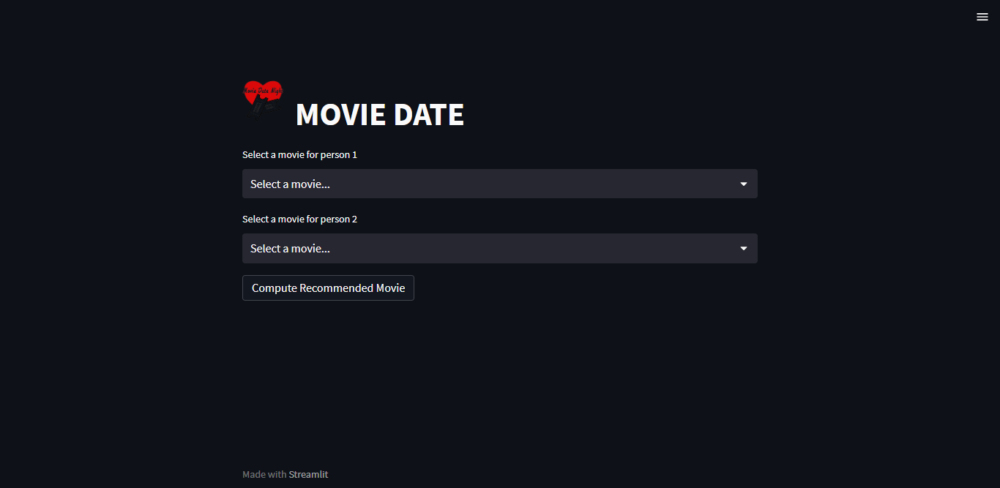
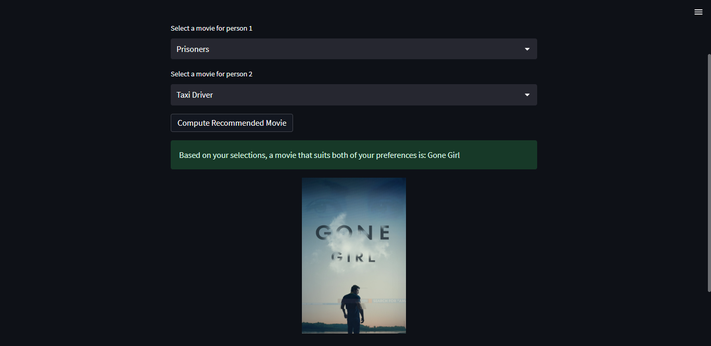

# Movie-Recommendation-System

Movie Date Recommendation System 

### Data Preprocessing

Before running the recommendation system, you need to preprocess the dataset using the `data_preprocessing.ipynb` Jupyter Notebook. Follow these steps:

1. Open the `data_preprocessing.ipynb` notebook in Jupyter Notebook or JupyterLab.
2. Execute the notebook to generate the `movies_encoded.csv` dataset.

### Running the Application

To run the application, follow these steps:

1. Make sure you have Streamlit installed (`pip install streamlit`).
2. Open a command prompt or terminal in the project's directory.
3. Run the following command:

   ```shell
   streamlit run app.py
   ```
This will start the application locally, and you can access it in your web browser.

### File Structure

`data_preprocessing.ipynb`: Jupyter Notebook for dataset preprocessing.
`app.py`: Streamlit application file.
`recommandation_system.py`: Module containing recommendation system functions.

### Dependencies

pandas
scikit-learn
streamlit

You can install the dependencies using `pip`. For example:
  ```shell
  pip install pandas scikit-learn streamlit
  ```




